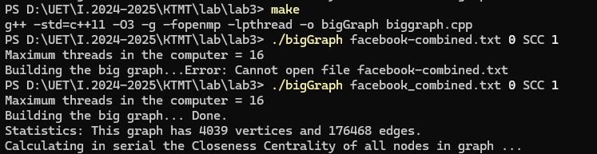

# LAB 3

- Họ và Tên: Trần Gia Khánh
- MSSV: 23021599

### Cấu hình máy cá nhân:

- CPU: AMD Ryzen 7 4800HS (8 nhân, 16 luồng)
- Ram: 24G ram (16 + 8, dual channel)

### Đoạn mã C++ hàm computeCCparallel đã được song song hoá với thư viện openmp

```cpp
// Compute in parallel the Closeness Centrality for all nodes
void computeCCparallel()
{
    auto start = chrono::high_resolution_clock::now();
    
    vector<double> CC(nodeNum, 0.0);
    
    #pragma omp parallel for
    for (uint32_t v = 0; v < nodeNum; v++)
    {
        uint32_t threadID = omp_get_thread_num();  
        auto &Q = Queues[threadID]; 
        uint32_t distance = 0;
        
        Q.clear();
        Q.push(v, 0);
        Q.next();
        
        SetBit(threadID, v);
        
        while (!Q.empty())
        {
            distance++;
            while (!Q.empty())
            {
                uint32_t s = Q.front();
                Q.pop();
                for (uint32_t w : Edges[s])
                {
                    if (TestBit(threadID, w))
                    {
                        continue;
                    }
                    Q.push(w, distance);
                    SetBit(threadID, w);
                }
            }
            Q.next();
        }
        
        ResetMap(threadID);
        distance = Q.sum();
        
        if (distance == 0)
        {
            CC[v] = 0.0;
        }
        else
        {
            CC[v] = (double)(nodeNum - 1) / distance;
        }
    }
    
    auto end = chrono::high_resolution_clock::now();
    auto duration = chrono::duration_cast<std::chrono::milliseconds>(end - start);
    cout << "Time: " << duration.count() << " milliseconds" << endl;

    if (verbose)
    {
        for (uint32_t v = 0; v < nodeNum; v++)
        {
            cerr << v << "==" << std::setprecision(4) << CC[v] << endl;
        }
    }
}
```

## 2. Đánh giá thực thi tuần tự

### Dataset: facebook_combined.txt



Lần 1:


Lần 2:


Lần 3:


Lần 4:


Lần 5: 


### Dataset: com-youtube.ungraph.txt

Do dataset này quá lớn nên em đã hiệu chỉnh một chút: số `nodenum` = 10000

Hàm chạy tuần tự sau khi có sự điều chỉnh:

```cpp
void computeCCserial()
{
	nodeNum = 10000;
	// vector<tuple<uint32_t, int>> Distances(nodeNum);
	vector<double> CC(nodeNum);

	for (uint32_t v = 0; v < nodeNum ; v++)
	{
		uint32_t threadID = 0;
		// travel SSSP from v
		auto &Q = Queues[threadID];
		uint32_t distance = 0;
		Q.clear();
		Q.push(v, 0);
		Q.next();
		SetBit(threadID, v);
		while (!Q.empty())
		{
			distance++;
			while (!Q.empty())
			{
				uint32_t s = Q.front();
				Q.pop();
				for (uint32_t w : Edges[s])
				{
					if (TestBit(threadID, w))
					{
						continue;
					}
					Q.push(w, distance);
					SetBit(threadID, w);
				}
			}
			Q.next();
		}
		ResetMap(threadID);
		distance = Q.sum();
		if (distance == 0)
			CC[v] = 0.0;
		else
			CC[v] = ((double)(nodeNum - 1) / distance);
	}

	// show results
	if (verbose)
	{
		for (uint32_t v = 0; v < nodeNum; v++)
		{
			cerr << v << "==" << std::setprecision(4) << CC[v] << endl;
		}
	}
}

```

Ta có thời gian chạy:


Đây là thời gian chạy đối với 10000 nodes.

Với số liệu gốc là hơn 1 triệu nodes ⇒ tổng thời gian ước tính là 885017^1,4 = 85763000 milliseconds

### Lý giải lý do tại sao mỗi lần thi hành lại có thời gian thi hành khác nhau:

- Có sự thay đổi trong tải hệ thống: Trong khi chương trình chạy, có những tiến trình khác sẽ chạy cùng lúc song song, sử dụng chung tài nguyên (CPU, Ram,…), gây ảnh hưởng đến thời gian chạy mỗi lần.
- Caching: Khi chạy chương trình nhiều lần, dữ liệu có thể được cache trong bộ nhớ, do đó có ảnh hưởng đến tốc độ chạy giữa những lần khác nhau.
- Yếu tố nhiễu: Yếu tố này khá ngẫu nhiên, có thể là do trạng thái máy, lượng % CPU đang load,…

### Giải pháp để đảm bảo đo được thời gian thi hành của thuật toán là chính xác nhất có thể

- Tính thời gian chạy nhiều lần rồi cộng lại chia trung bình. Sai số giữa các lần chạy là rất thấp, ta có thể tính tổng chúng lại rồi chia trung bình cho số lần để ra kết quả của thuật toán.
- Giảm thiểu tác động từ hệ thống. Trước khi chạy, ta có thể tắt hết tất cả các ứng dụng không cần thiết, để ưu tiên cho hệ thống chạy thuật toán.
- Khởi động lại máy trước khi chạy.

## 3. Song song hoá thuật toán

**ĐỐI VỚI DATASET FACEBOOK_COMBINED.TXT**

- Xây dựng hàm:

```cpp
// Compute in parallel the Closeness Centrality for all nodes
void computeCCparallel()
{
    auto start = chrono::high_resolution_clock::now();
    
    vector<double> CC(nodeNum, 0.0);
    
    #pragma omp parallel for
    for (uint32_t v = 0; v < nodeNum; v++)
    {
        uint32_t threadID = omp_get_thread_num();  
        auto &Q = Queues[threadID]; 
        uint32_t distance = 0;
        
        Q.clear();
        Q.push(v, 0);
        Q.next();
        
        SetBit(threadID, v);
        
        while (!Q.empty())
        {
            distance++;
            while (!Q.empty())
            {
                uint32_t s = Q.front();
                Q.pop();
                for (uint32_t w : Edges[s])
                {
                    if (TestBit(threadID, w))
                    {
                        continue;
                    }
                    Q.push(w, distance);
                    SetBit(threadID, w);
                }
            }
            Q.next();
        }
        
        ResetMap(threadID);
        distance = Q.sum();
        
        if (distance == 0)
        {
            CC[v] = 0.0;
        }
        else
        {
            CC[v] = (double)(nodeNum - 1) / distance;
        }
    }
    
    auto end = chrono::high_resolution_clock::now();
    auto duration = chrono::duration_cast<std::chrono::milliseconds>(end - start);
    cout << "Time: " << duration.count() << " milliseconds" << endl;

    if (verbose)
    {
        for (uint32_t v = 0; v < nodeNum; v++)
        {
            cerr << v << "==" << std::setprecision(4) << CC[v] << endl;
        }
    }
}
```


Lần 1:


Lần 2:


Lần 3:


Lần 4:


Lần 5:


Qua 5 lần đo thời gian khi chuyển thuật toán sang sử dụng thi hành song song, speed up trung bình là:

$$
\text{speedup} = \text{time tuần tự} / \text {time song song} = 1.5
$$

**ĐỐI VỚI DATASET COM-YOUTUBE.UNGRAPH.TXT**

- Xây dựng lại hàm (nodeNum = 10000):

```cpp
void computeCCparallel()
{
	nodeNum = 10000;
    omp_set_num_threads(threadNum);
    
    vector<double> CC(nodeNum, 0.0);
    #pragma omp parallel for
    for (uint32_t v = 0; v < nodeNum; v++)
    {
        uint32_t threadID = omp_get_thread_num();  
        auto &Q = Queues[threadID]; 
        uint32_t distance = 0;
        
        Q.clear();
        Q.push(v, 0);
        Q.next();
        
        SetBit(threadID, v);
        
        while (!Q.empty())
        {
            distance++;
            while (!Q.empty())
            {
                uint32_t s = Q.front();
                Q.pop();
                for (uint32_t w : Edges[s])
                {
                    if (TestBit(threadID, w))
                    {
                        continue;
                    }
                    Q.push(w, distance);
                    SetBit(threadID, w);
                }
            }
            Q.next();
        }
        
        ResetMap(threadID);
        distance = Q.sum();
        
        if (distance == 0)
        {
            CC[v] = 0.0;
        }
        else
        {
            CC[v] = (double)(nodeNum - 1) / distance;
        }
    }

    if (verbose)
    {
        for (uint32_t v = 0; v < nodeNum; v++)
        {
            cerr << v << "==" << std::setprecision(4) << CC[v] << endl;
        }
    }
}
```

Tổng thời gian chạy đối với 10000 nodes là:

Lần 1:


Lần 2:


Lần 3:


Lần 4:


⇒ Speed up trung bình là:

$$
\text{speedup} = \text{time tuần tự} / \text {time song song} = 9.5
$$

## 4. Kiểm soát quá trình tính toán song song

- Lần lượt hiệu chỉnh `threadNum` lần lượt thành 4, 8


Ta thấy code không chạy, nhưng đây là đối với “xử lý song song”

Tuy nhiên:


Với lần lượt hai hiệu chỉnh như trên, với “xử lí tuần tự”, thì code cho ra thời gian xử lí khá tương đồng với code ban đầu với setup là max số thread. Theo như hệ thống máy là 16 threads. Cái này có thể do chip AMD của em có siêu phân luồng và nỗ không hỗ trợ phần chạy với numthreads cố định hoặc được setup trước.

Nhưng khi hiệu chỉnh threadNum về những số ≥ 16 (base máy) thì code “xử lý song song” đã chạy và cho ra thời gian có phần nhanh hơn một chút so với code gốc.


Ảnh trên với setup threadNum là 17.

### Tổng kết:

- **ThreadNum có ảnh hưởng đến thời gian chạy**: Có, nhưng ảnh hưởng không phải lúc nào cũng là giảm thời gian. Nếu số lượng thread quá lớn so với số lõi có sẵn hoặc không tương thích với tài nguyên hệ thống, **thời gian có thể tăng lên** do **overhead** trong việc quản lý các thread, **xung đột tài nguyên** và **chi phí đồng bộ hóa**.
- **Càng tăng số lượng threadNum không nhất thiết thời gian càng giảm**: Nếu số thread vượt quá số lõi CPU hoặc tài nguyên hệ thống, **hiệu suất có thể giảm**. Tối ưu số thread thường là **số lượng lõi vật lý hoặc lõi logic tối đa** của CPU.